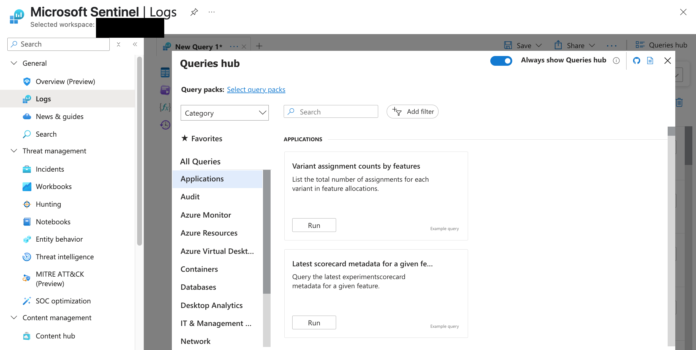
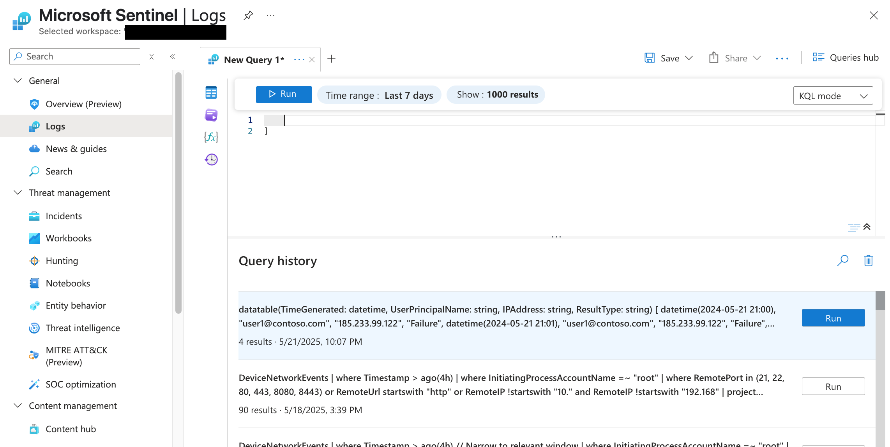
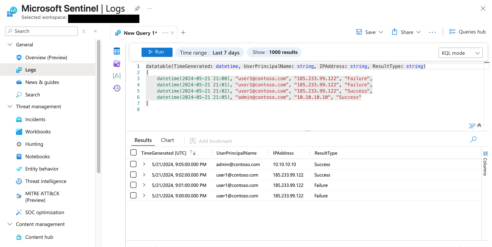
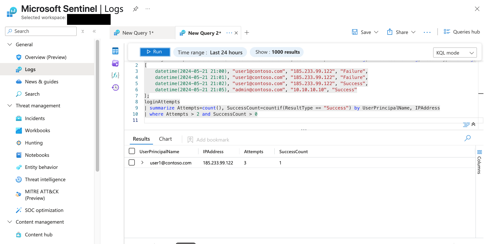

# 🔐 Suspicious Login Investigation – Brute Force Pattern (Microsoft Sentinel Lab)

## 📘 Lab Overview

This lab was designed to help me build real-world SOC analyst skills using Microsoft Sentinel and Kusto Query Language (KQL). I created a simulated dataset of login events to practice identifying suspicious behavior, specifically, multiple failed logins followed by a successful one from the same IP address.

The goal: Learn how to detect brute-force or credential stuffing patterns and think like a threat hunter.

---

## 🛠️ Tools Used

- **Microsoft Sentinel** (via Azure portal)
- **Log Analytics Workspace**
- **Kusto Query Language (KQL)**
- **Custom test dataset**
- **Manual alert triage logic**

---

## 🧪 Lab Steps

1. **Accessed Microsoft Sentinel** and opened the Logs section
2. **Created a sample dataset** using the `datatable()` function to simulate login attempts
3. **Wrote and ran a KQL query** to identify accounts with multiple failed logins followed by success
4. **Saved the query** using the “Legacy query” method under the category `fee labs`
5. **Analyzed the results** to draw conclusions about potential threat behavior

---

## 🧠 Key Findings

- **User involved:** `user1@contoso.com`
- **IP address:** `185.233.99.122`
- **Behavior observed:** 2 failed logins followed by 1 successful login from the same IP, within a short time window
- **Interpretation:** This pattern may suggest brute-force behavior or the use of compromised credentials
- **Outcome:** While this could also indicate a user typo, the consistent IP and quick success after failures made this worth deeper analysis

---

## 🧭 Analyst Mindset & Reflection

In this lab, I practiced more than just writing queries—I practiced critical thinking:

- I asked **what normal behavior looks like**, and compared it to the data
- I formed a narrative: *Who logged in, when, from where, and with what result?*
- I questioned if the activity made sense, or if it warranted escalation
- I thought through **next steps**: checking IP reputation, user login history, and post-login behavior

---

### 📂 Screenshots

| Step | Description | Screenshot |
|------|-------------|------------|
| 1 | Sentinel main dashboard |  |
| 2 | Logs section open |  |
| 3 | Created sample dataset |  |
| 4 | Ran detection query |  |
| 5 | Saved query as legacy | ![05_saved_query_or_notes.png](./screenshots/05_saved_query_or_notes.png |

---

## 💾 Saved Query Details

- **Query Name:** Suspicious Login Investigation – Brute Force Pattern  
- **Saved As:** Legacy Query  
- **Category:** fee labs  
- **Purpose:** Detects multiple failed logins followed by a success from the same IP

---

> _“Good analysts don’t just find alerts,they tell stories the system didn’t.”_

